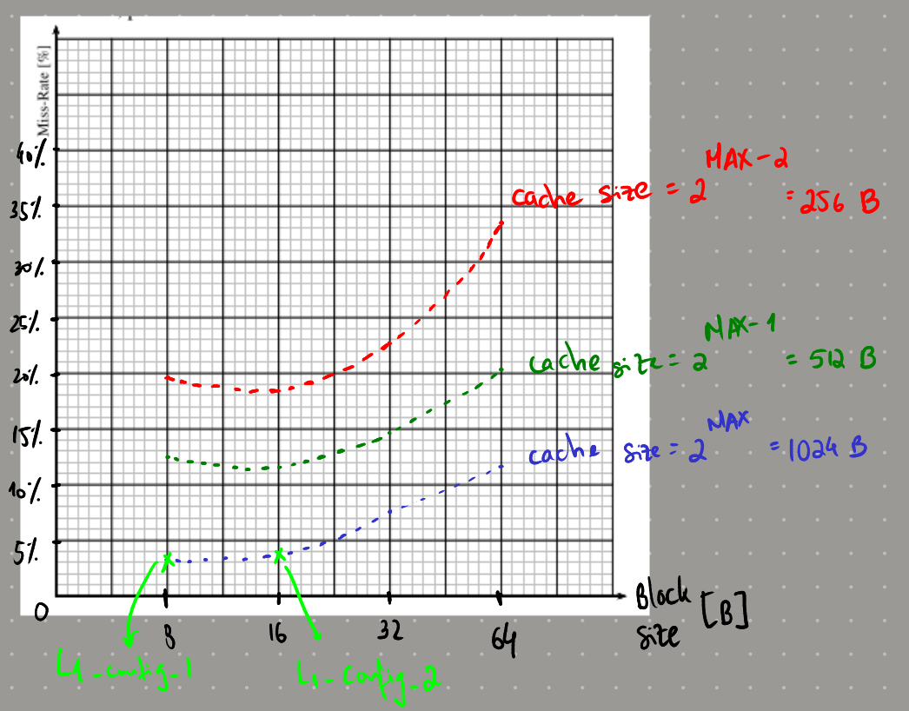
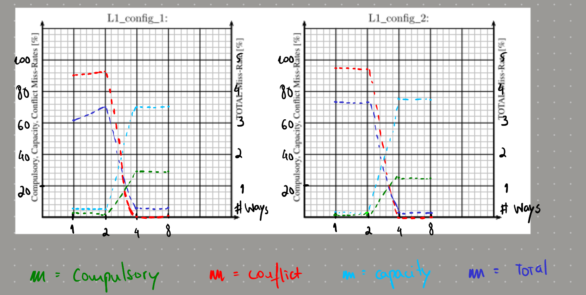

# Answers

## 2.1

The critical sequence of accesses is the "MB processing" section, which ranges from lines 240 to 281 in the source code.

## 2.3

### 2.3.1.1

Compulsory cache misses are misses that occur when a block is accessed for the first time - they're unavoidable. Conflict misses occur when two blocks are mapped to the same cache line: since they can't both occupy the same line, one of them will be evicted. Capacity misses occur when the cache is full and a new block is accessed: the cache must evict a block to make room for the new one.

### 2.3.1.2

There are two main policies to deal with writes in memory hierarchies. With write-through, we opt to write information both in cache and the main memory whenever there's a write, so that the information is always matching. With write-back, we opt to write information only in cache, writing to the main memory only when the cache line is evicted (this last part can be "circumvented" with a buffer, which writes to the main memory when full). This is generally more efficient, since we usually don't want to always go to memory, since it's very time consuming, but it can lead to inconsistencies between the cache and the main memory.

### 2.3.2

a)

(128 × 0.01) / 1024 = 0.00125€ para o frame buffer (desenhar regra de três simples!)
((0.02 − 0.00125) × 1024) / 10 = 1.92KB para L1
como tem de ser potência de dois, fica 2^floor(log(1966.08B))=1024B=1KB

b)

| BLOCK SIZE/CACHE SIZE | 256B   | 512B   | 1024B  |
| --------------------- | ------ | ------ | ------ |
| 8B                    | 0.1960 | 0.1247 | 0.0305 |
| 16B                   | 0.1829 | 0.1184 | 0.0363 |
| 32B                   | 0.2288 | 0.1492 | 0.0770 |
| 64B                   | 0.3340 | 0.2021 | 0.1181 |

c)

d)

L1_config_1:

- Cache Size: 1024B
- Block Size: 8B
- Miss Rate: 0.0305
- Cost = Price x Miss Rate: 0.000298€

L1_config_2:

- Cache Size: 1024B
- Block Size: 16B
- Miss Rate: 0.0363
- Cost = Price x Miss Rate: 0.00035449€

### 2.3.3

a)

| MISS RATE/CONFIGS | C1, 1 way | C1, 2 ways | C1, 4 ways | C1, 8 ways | C2, 1 way | C2, 2 ways | C2, 4 ways | C2, 8 ways |
| ----------------- | --------- | ---------- | ---------- | ---------- | --------- | ---------- | ---------- | ---------- |
| Compulsory        | .00077470 | .00077112  | .00077193  | .00077652  | .00038478 | .00038584  | .00039104  | .00038608  |
| Capacity          | .02801730 | .03318315  | .00002214  | .00001188  | .03481533 | .03481660  | 0          | 0          |
| Conflict          | .00171105 | .00174216  | .00190593  | .00191160  | .00109989 | .00119756  | .00120896  | .00121392  |
| Total             | .03050305 | .03569643  | .00270000  | .00270000  | .03630000 | .03640000  | .00160000  | .00160000  |

b)

c)

For both cache configurations, having 4 or 8 ways is clearly the best option, since the lowest total miss rates (very close to 0%) happen with these number of ways. Both configurations show a very similar behavior overall, which can be easily seen just by glancing at the plots: one could argue, still, that the best configuration should probably be the one with a block size of 16 Bytes (the second one) and 4 ways, since it shows the lowest total miss rate.

d)

AMAT formula: hit time + miss rate \* miss penalty
According to Table 1:

- t(L1, H) = (L1) hit time = 2 _ (0.7 + 0.35 _ log2(#ways))ns
- t(L1, M) = (SDRAM) miss penalty = going to memory = 140ns

Therefore, AMAT = 2*(0.7 + 0.35*log2(#ways)) + p(L1, M) \* 140

e)

| THINGIES/CONFIGS | C1, 1 WAY    | C1, 2 WAYS   | C1, 4 WAYS   | C1, 8 WAYS   | C2, 1 WAY    | C2,2 WAYS    | C2, 4 WAYS   | C2, 8 WAYS   |
| ---------------- | ------------ | ------------ | ------------ | ------------ | ------------ | ------------ | ------------ | ------------ |
| MISS RATE        | 0.03050305   | .03569643    | .00270000    | .00270000    | .03630000    | .03640000    | .00160000    | .00160000    |
| AMAT             | 5.6704270000 | 6.6082211968 | 2.1994419938 | 2.4101629908 | 6.4820000000 | 6.7067209968 | 2.0454419938 | 2.2561629908 |
| PRICE            | .0110156250  | .0110156250  | .0110156250  | .0110156250  | .0110156250  | .0110156250  | .0110156250  | .0110156250  |
| COST FUNCTION    | .0624632974  | .0727936866  | .0242282282  | .0265494516  | .0714032812  | .0738787234  | .0225318219  | .0248530454  |

f)

The best choice is the one minimizing the given cost function: in this case, the second configuration with 4 ways looks like the best option (matching the answer in 2.3.3 c)). Just as has been noted before, configurations with 4 or 8 ways are clearly superior in comparison with their peers: the mean access time ends up being about 2-3x smaller with these configurations!
